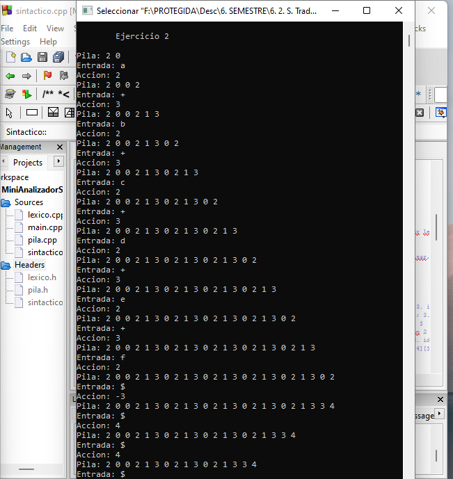
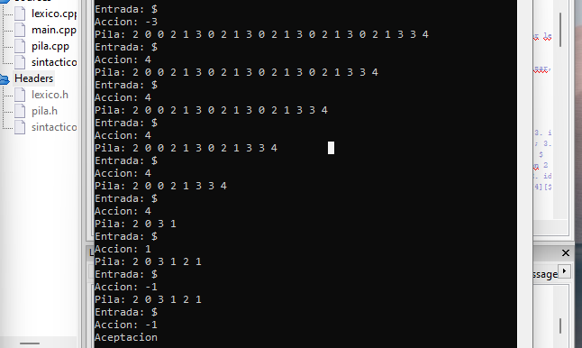

# Mini Analizador Sintáctico con Objetos

El contenido de esta etapa tiene la implementación del código para el uso de una pila de objetos. Será posible leer cadenas como objetos de entrada, para de esta manera analizar y buscar los componentes sintácticos en la tabla LR para llegar a la aceptación de los ejercicios 1 y 2 que recibe, comprobando si los tokens que se obtienen son legales.

En las imagenes se muestra cómo se realiza el análisis mediante el Algoritmo de apilar:

