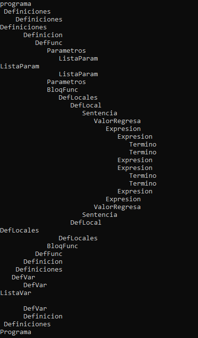
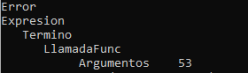

### Análizador Sintáctico Gramática

El Analizador Sintáctico desarrollado en esta etapa comprueba la correcta construcción de las cadenas introducidas, de manera que en base al 'Archivo.lr', se utilizó la matriz de las reglas de la gramática, donde los atributos de dichas reglas son utilizados mediante nodos. Los atributos corresponden a el id de la regla, nombre de la regla y cantidad de tokens de la regla, información la cuál se va a guardar en para su impresión final en el Árbol Sintáctico. Cada regla tiene su propia clase con sus atributos con su método 'muestra()'.
Para las pruebas de este análizis, se utilizaron las entradas "int a; int suma(int a, int b){ return a+b; }" "int main(){ float a; int b; int c; c = a+b; c = suma(8,9); }".

Las imagenes anteriores corresponden a el recorrido del Árbol Sintáctico.
Los cambios realizados para la implementación de este programa se realizaron en los archivos 'Pila.h', 'Pila.cpp', 'Sintactico.h', 'Sintactico.cpp' y 'ArbolSintactico', que es hizo en base a la documentación proporcionada por el profesor.
