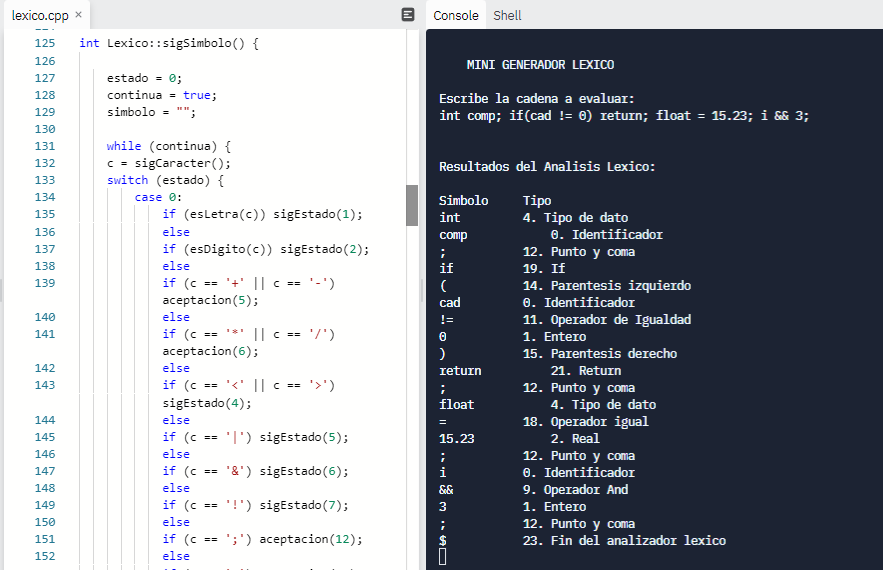

# Analizador Léxico

Para la implementación  de este programa se cambios a partir del mini generador léxico, donde se agregaron más opciones para los tokens, de acuerdo a la tabla presentada para la actividad.

El programa comienza solicitando una cadena al usuario, de manera que cuando este la introduce, el código va validando mediante estructuras simples si dirigirse a un estado de aceptación o al siguiente estado, para evaluar si es de aceptación. De esta manera, se va avanzando en la cadena, evaluando cada token para identificarlo, y regresandose una posición cuando es necesario para evaluar el siguiente token. Cuando termina de evaluarse todos los tokens, se imprime el final del analizador léxico, determinado por el carácter '$'.

Se agregó también la función de aceptacion2, porque anteriormente, se imprimian la identificación de algunos tokens que capturaban un carácter de más. 

En la imagen se muestra una prueba de distintos tokens en el analizador léxico y cómo identifica el tipo de cada uno:

