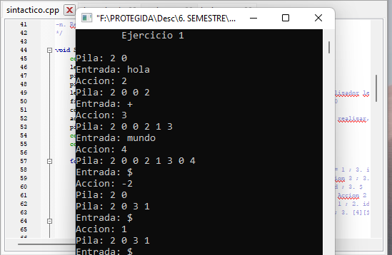
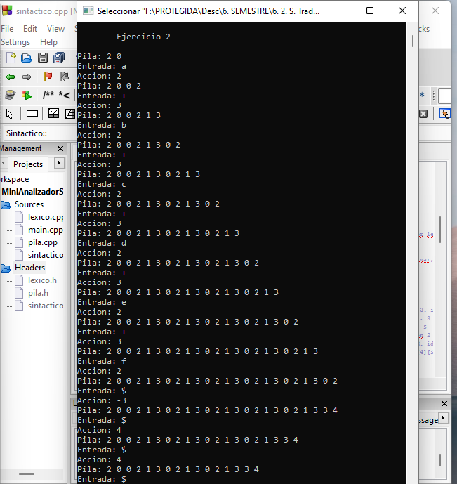
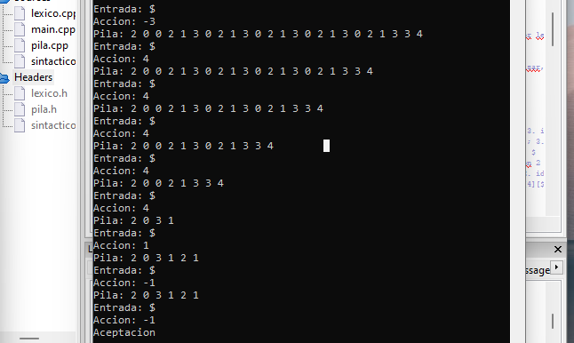

# Mini Analizador Sintáctico

Para la implementación  de este programa se utiliza el compilador del analizador léxico junto con el manejo de una Pila para llegar al estado de aceptación de los ejercicios 1 y 2. 

El programa se desarrolla mediante el uso de una Pila de enteros, que va validando la cadena ingresada en el programa, observando lo que se encuentra en la entrada y salida con la tabla de reducciones. Observandolo más detalladamente, se puede decir que a partir de '$0' que se introducen al principio de la pila, se va a introducir el nuevo token que se encuentre en entrada, para identificarlo, comparar la pila con el resultado de la identificación del analizador léxico, y luego determinar la acción a realizar, mostrando lo que se encuentra actualmente en la pila hasta que ocurra una reducción de la regla 1, o para el ejercicio dos, que ocurran las reducciones de la regla 2 y de la 1 para su aceptacion.

En la imagen se muestran los distintos tokens analizados, en la entrada, salida y la pila:

