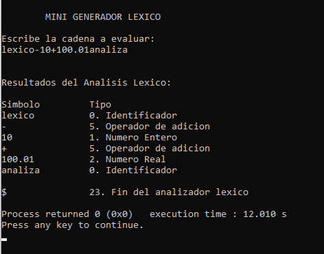
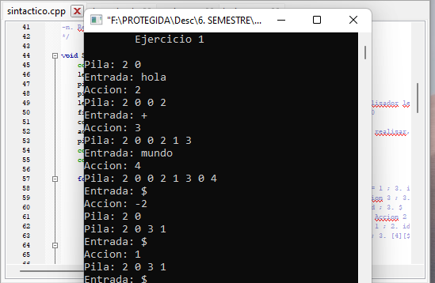
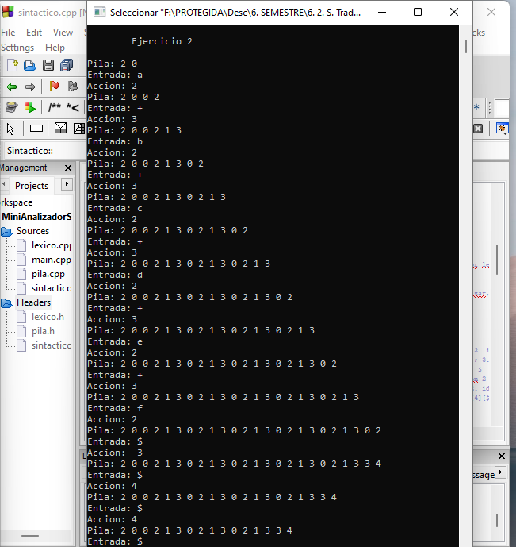
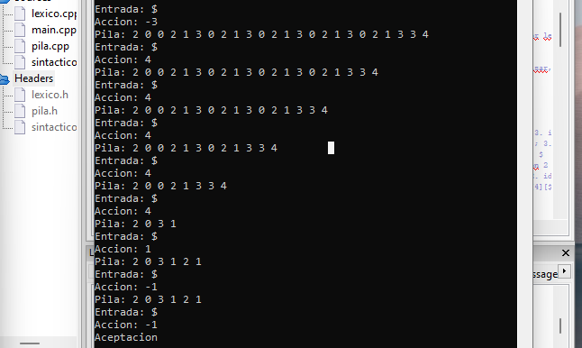

# Compilador_SSPTLII

En este repositorio se encuentran las carpetas donde se encuentra el código de las actividades realizadas para el desarrollo del Proyecto para la materia Seminario de Solución de Problemas de Traductores de Lenguaje II.

Las actividades para el desarrollo del Compilador se encuentran divididas en las siguientes carpetas:

* Actividad 1: **MiniAnalizadorLexico** - Mini Analizador Léxico
* Actividad 2: **Compilador_SSPTLII** - Analizador Léxico
* Actividad 3: **MiniAnalizadorSintactico** - Mini Analizador sintáctico
* Actividad 4: **AnalizadorSintacticoObjetos** - Analizador Sintáctico implementación usando Objetos
* Actividad 5: **AnalizadorSintacticoGramatica** - Gramática del compilador

## Mini Analizador Léxico

El contenido de esta primera etapa tiene la implementación del código para el comienzo del desarrollo de un compilador: el Análisis Léxico, con el cuál, será posible  leer secuencias de caracteres de entrada, para de esta manera analizar y buscar los componentes léxicos que recibe, comprobando si los tokens que obtiene son legales para el análisis de identificadores, números enteros, números reales, junto con operadores de adición y de multiplicacion.

En la imagen se muestra una prueba de los tokens que identifica el mini analizador léxico:

La entrada de la cadena obtenida en 'main.cpp', de manera que cuando se obtiene un token, se analiza en los distintos casos posibles:
- Determinar si es una letra
- Determinar si es un digito
- Determinar si es un carácter de adición
- Determinar si es un carácter de multiplicación

Dentro de la carpeta *MiniAnalizadorLexico_SSPTLII*, en el README.ms se puede leer más información acerca de ello.

## Analizador Léxico

El programa comienza solicitando una cadena al usuario, de manera que cuando este la introduce, el código va validando mediante estructuras simples si dirigirse a un estado de aceptación o al siguiente estado, para evaluar si es de aceptación. De esta manera, se va avanzando en la cadena, evaluando cada token para identificarlo, y regresandose una posición cuando es necesario para evaluar el siguiente token. Cuando termina de evaluarse todos los tokens, se imprime el final del analizador léxico, determinado por el carácter '$'.
En esta etapa se agregaron más opciones para los tokens, de acuerdo a la tabla presentada para la actividad. Se agregó también la función de aceptacion2, porque anteriormente, se imprimian la identificación de algunos tokens que capturaban un carácter de más. 

En la imagen se muestra una prueba de distintos tokens en el analizador léxico y cómo identifica el tipo de cada uno:

Los casos posibles según la tabla proporcionada, se pueden clasificar como:
- Letra
- Digito
- Operador de adición
- Operador de multiplicación
- Operador relacional
- Operador lógico
- Operador de igualdad
- Parentesis, corchete
- Coma, punto y coma

Dentro de la carpeta *Compilador_SSPTLII*, en el README.ms se puede leer más información acerca de ello.

## Mini Analizador Sintáctico

El programa se desarrolla mediante el uso de una Pila de enteros, que va validando la cadena ingresada en el programa, observando lo que se encuentra en la entrada y salida con la tabla de reducciones. Observandolo más detalladamente, se puede decir que a partir de '$0' que se introducen al principio de la pila, se va a introducir el nuevo token que se encuentre en entrada, para identificarlo, comparar la pila con el resultado de la identificación del analizador léxico, y luego determinar la acción a realizar, mostrando lo que se encuentra actualmente en la pila hasta que ocurra una reducción de la regla 1, o para el ejercicio dos, que ocurran las reducciones de la regla 2 y de la 1 para su aceptacion.

En la imagen se muestran los distintos tokens analizados, en la entrada, salida y la pila:

Dentro de la carpeta *MiniAnalizadorSintactico_SSPTLII*, en el README.ms se puede leer más información acerca de ello.

## Mini Analizador Sintáctico con Objetos

El contenido de esta etapa tiene la implementación del código para el uso de una pila de objetos, de manera que es posible leer cadenas como objetos de entrada, para de esta manera analizar y buscar los componentes sintácticos en la tabla LR para llegar a la aceptación de los ejercicios 1 y 2 que recibe, comprobando si los tokens que se obtienen son legales.

En las imagenes se muestra cómo se realiza el análisis mediante el Algoritmo de apilar con Objetos:

Se implementó la clase padre ElementoPila, donde de ella surgen sus clases hijos 'Terminal', 'NoTerminal' y 'Estado' para que la clase Pila que tenia originalmente, reciba los objetos que regresan estas clases, los cuales se analizan al introducir uno a uno en la Pila de objetos ya sea con su clasificación de Terminal, Estado o No Terminal.
Dentro de la carpeta *AnalizadorSintacticoObjetos_SSPTLII*, en el README.md se puede leer más información acerca de ello.

# Proyecto IoT NODEMCU8266 Sensor

En este apartado se muestra cómo se desarrolla el despliegue de la implementación del Proyecto del Internet son un Sensor, el cuál conecta una placa NODEMCU8266 con un broker, utilizando las tecnologías de Docker, K8s, K3S, K3D y Rancher.
En la carpeta *IoT-NODEMCU8266-Sensor* se encuentran los archivos utilizados para el desarrollo, donde en el archivo 'Proyecto-IoT' se puede observar más información acerca del mismo.

## Arquitectura del Proyecto

En la siguiente imagen se muestra la arquitectura propuesta para que el sistema muestre el uso de los sensores y el led mediante el broker EMQX.

## Despliegue del Proyecto

### Instalaciones para el despliegue

Para el despliegue del proyecto se debe de tener como herramientas:
* Una placa NODEMUC8266
* Cable usb con puerto Micro-B
* 2 leds
* 2 fotoresistencias
* 1 resistencia
* Para observar mejor el funcionamiento del módulo de internet, se recomienda una PowerRank

Y previamente instalado:
* Arduino IDE
* Docker
Además de algunas otras las cuales se mencionan sus comandos de instalación en el documento 'Proyecto-IoT' como:
* Chocolatey
* K3S, K3D, Rancher

### Desarrollo del Despliegue

Una vez que instaladas y obtenidas las anteriores herramientas, primeramente se tiene que abrir el IDE de Arduino para cargar el archivo 'NODEMCU2'. En este caso, arduino solicitará hacer la creación de una carpeta, a lo cuál le daremos permiso. Una vez con el código dentro de Arduino, se debe de instalar la libreria que permite el uso de la placa NODEMCU8366, para lo cuál, se sugieren los siguientes pasos:

1. Primeramente ir al repositorio oficial del ESP8266: https://github.com/esp8266/arduino 
2. Ahi se encuentra el link oficial que le dice a Arduino qué descargar para el uso de NODEMCU8366: https://arduino.esp8266.com/stable/package_esp8266com_index.json
3. En el IDE de Arduino, abrir 'Archivo>Preferencias' y pegar el link en 'Gestor de URLs Adicionales de Tarjetas: '
4. Dar click en Ok

Ya con la libreria descargada, conectamos la NODEMCU8266 a uno de los puertos de nuestra máquina, conectando nuestra placa con el IDE de la siguiente forma:
5. Ir a 'Herramientas>Placa:Arduino/Genuino Uno>Gestor de tarjetas'
6. En el campo de busqueda poner 'esp8266' y al encontrarlo, instalar dicha librería
7. Cerrar el Gestor de tarjetas y abrirlo nuevamente
8. Podemos observar ahora la placa NODEMCU8266, de manera que ahora se debe de dar click en 'Generic ESP8266 Module' (Es la 01) para seleccionarla
Pd. También existe la ESP8285 (Es la 12)
9. En herramientas checar los siguientes atributos:
   Flash Size: Se debe de observar si es 01 o 12, como se mencionó anteriormente
    Upload Speed: Es el nivel de carga del programa, esto depende del valor y carga del puerto y del usb
10. En caso de no poder, orientarse mediante el siguiente url de Youtube, link video: https://www.youtube.com/watch?v=0g7sazWXfEI

De esta manera, una vez seleccionada la placa, procedemos a, dentro del código, poner nuestra red de internet a la cuál nos conectaremos, junto con su contraseña. Así, ya podemos compilar el programa para cargarlo a la placa, de esta forma, comenzará a buscar la señal del internet previamente configurado, y en la pantalla de salida del IDE, esperaremos hasta observar el mensaje de que 'Se ha conectado al internet'. 
El siguiente paso es opcional, el cuál consiste en decidir si dejar la placa conectada a la computadora o conectar la placa a un PowerRank (cuando se conecta a este último, se demuestra que la placa puede seguir utilizando el programa aún cuando ya no esta conectado a nuestro equipo, utilizando su modulo ESP8266 que contiene el dispositivo WiFi.

Las conexiones que fueron utilizadas de acuerdo a al diagrama de la arquitectura se muestran en la siguiente imagen:

Además, n el siguiente link se explica a mayor detalle cómo se realizó este apartado del proyecto además de la demostración del funcionamiento del mismo: https://drive.google.com/file/d/1ddA4rBIDVZXG3Wm8QdmoKxumuqb20x7B/view?usp=sharing

Después, el siguiente paso es dirigirnos al Broker EMQX de la siguiente manera:

1. Entrar a la página emqx.com/en
2. Dirigirse al apartado gratis y publico, con este link:
https://www.emqx.com/en/mqtt/public-mqtt5-broker o buscar la opción 'Publick mqtt5 broker'
3. Ir y dar click al botón de 'Learn more...' en el apartado de Online MQTT Client
4. Dar click en el botón de 'Visit MQTT WebSocket Toolkit'
5. Click en New conection
6. Crear un client

7. En el apartado de 'Tools' dar click en 'Websocket' y hacer las siguientes configuraciones:
   1. Name: ESP8266
   2. Client ID: esp8266-client
   3. Username: admin
   4. Password: public
8. Dar click en el botón 'Connect' y observar que la placa marque como Connected

9. Por último, en 'Messsages', configurar:
   1. Topic: esp8266/test
   2. Messages: 1 (para encender) o 0 (para apagar)
   3. Dar click en botón para enviar y vemos si se envió el mensaje

De esta manera, si el mensaje ha sido enviado correctamente, el led de la placa NODEMCU8266 prenderá o se apagará, según reciba el mensaje.

En el broker, se mostrará la información que se obtiene de los resultados del sensor:

